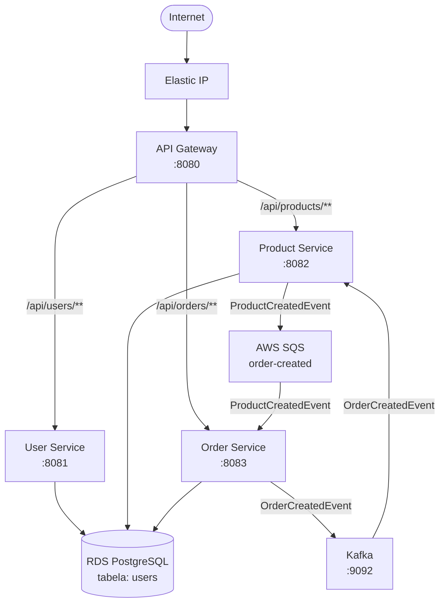

# Arquitetura do Sistema

## Diagrama de Arquitetura

## Componentes

### Rede (VPC)

| Componente | CIDR | Descrição |
|---|---|---|
| VPC | 10.0.0.0/16 | Rede principal |
| Subnet pública | 10.0.1.0/24 | EC2 + API Gateway |
| Subnet privada 1 | 10.0.3.0/24 | RDS (eu-central-1a) |
| Subnet privada 2 | 10.0.4.0/24 | RDS (eu-central-1b) |

### Security Groups

| Security Group | Regras de entrada | Propósito |
|---|---|---|
| sg-web | 22, 80, 443, 8080-8083 | EC2 |
| sg-db | 5432 (só do sg-web) | RDS |

### Compute

| Componente | Tipo      | Descrição |
|---|-----------|---|
| EC2 | t3.medium | Corre todos os containers |
| Elastic IP | Dinamico  | IP fixo |
| IAM Role | ec2-role  | Permissões SQS |

### Base de Dados

| Componente | Tipo | Descrição |
|---|---|---|
| RDS | PostgreSQL | db.t3.micro |
| Tabelas | users, products, orders, order_items | Criadas automaticamente pelo Hibernate |

### Mensageria

| Componente | Tipo | Fluxo |
|---|---|---|
| Kafka | Confluent 7.5.0 | order-service → product-service |
| SQS | AWS Standard | product-service → order-service |
| DLQ | AWS Standard | Mensagens falhadas (max 3 tentativas) |

## Fluxos de Comunicação

### Fluxo Síncrono (HTTP)
Cliente → API Gateway → User/Product/Order Service → RDS

### Fluxo Assíncrono — Kafka
Order criada → order-service publica OrderCreatedEvent → Kafka → product-service consome → diminui stock no RDS

### Fluxo Assíncrono — SQS
Produto criado → product-service publica ProductCreatedEvent → SQS → order-service consome → regista produto disponível
